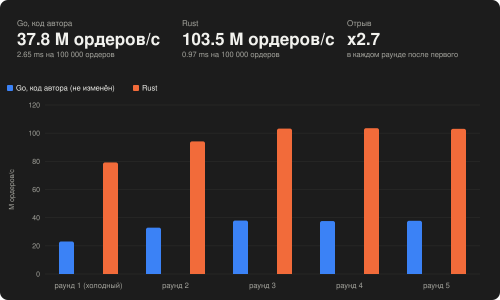
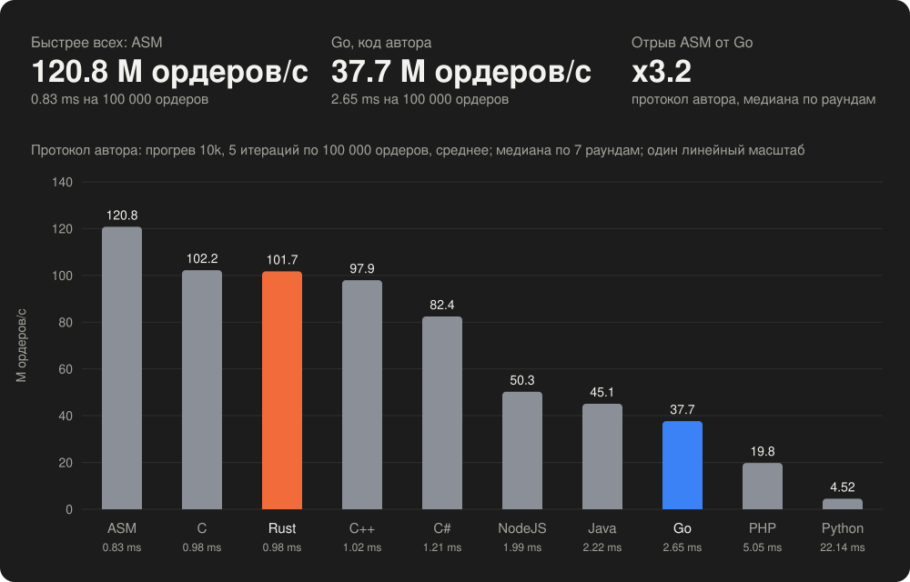

# Matching Engine: Go vs Rust

Движок матчинга лимитных ордеров на Go и на Rust с одинаковой семантикой,
одинаковым потоком ордеров и одинаковым протоколом замера.



Замер по протоколу автора (`WARM=1 ROUNDS=5 ./run_benchmark.sh`, Apple M4):
в установившемся режиме Go даёт 2.65 ms на 100 000 ордеров (37.8 M ордеров/с),
Rust — 0.97 ms (103.5 M ордеров/с), **Rust быстрее в 2.7 раза**; сделки и объём
у обеих сторон совпадают (77 576 / 1 973 216). Код Go не изменён.

## Одиннадцать реализаций, один движок

Тот же генератор ордеров (Xorshift64, seed `0xDEADBEEFCAFE1234`), та же
семантика матчинга (price-time priority, FIFO внутри уровня, частичные
исполнения), тот же протокол замера и тот же формат вывода — на десяти
языках, причём Go представлен дважды: нетронутый код автора (`golang/`) и
`go/` с той же плоской книгой, что у остальных. Каждая реализация обязана
дать `trades=77576, volume=1973216, resting=21620, 55/50 уровней` и совпасть
с Rust на других seed; иначе прогон помечается FAIL. Внешних зависимостей
нет ни у одной.



| # | Язык | ms на 100 000 ордеров | M ордеров/с | к лучшему | к Go автора | Структура |
|---|---|---|---|---|---|---|
| 1 | **ASM** (ARM64, ядро на ассемблере + C-обвязка) | **0.86** | **116.4** | x1.00 | **x3.2** | плоская книга + битовая карта, регистры |
| 2 | C | 1.00 | 100.2 | x1.16 | x2.7 | плоская книга + битовая карта |
| 3 | Rust | 1.01 | 99.4 | x1.17 | x2.7 | плоская книга + битовая карта |
| 4 | C++ | 1.01 | 98.7 | x1.18 | x2.7 | плоская книга + битовая карта |
| 5 | C# (.NET 10) | 1.22 | 82.2 | x1.42 | x2.2 | плоская книга, массивы/Span |
| 6 | **Go (flat)** — `go/`, тот же алгоритм на Go | 1.60 | 62.6 | x1.86 | x1.7 | плоская книга, `uint32`-арена без указателей |
| 7 | NodeJS (v25) | 2.04 | 49.1 | x2.37 | x1.3 | типизированные массивы |
| 8 | Java (JDK 26) | 2.27 | 44.0 | x2.65 | x1.2 | примитивные массивы |
| 9 | **Go (автор)** — `golang/`, код не изменён | 2.70 | 37.0 | x3.15 | x1.0 | сортированный массив уровней, O(n)-сдвиги |
| 10 | PHP 8.5 | 5.10 | 19.6 | x5.9 | x0.5 | плоские массивы |
| 11 | Python 3.14 | 22.24 | 4.5 | x25.9 | x0.1 | списки |

Apple M4, `WARM=1 ROUNDS=7 ./run_benchmark.sh`, медиана Average по 7 раундам.
Два вывода, которые видны из таблицы:

* **Алгоритм.** Та же плоская книга ускоряет Go в 1.7 раза (`golang/` →
  `go/`): половина отставания автора — структура данных, а не язык.
* **Язык.** При одном и том же алгоритме Rust/C/C++ быстрее Go в 1.6 раза,
  ассемблер — в 1.9: это цена GC-барьеров, bounds check и отсутствия
  контроля над раскладкой. Rust, C и C++ — один бэкенд LLVM, поэтому они в
  пределах шума друг от друга; ассемблер выигрывает ~15% ручным
  распределением регистров.

## Запустить у себя

Нужны Go 1.21+ и Rust 1.85+; для остальных — clang (Xcode CLT), .NET 10,
JDK, PHP 8, Node — если чего-то нет, эта реализация пропускается.

Все реализации, протокол автора, три холостых прогона и 7 раундов на
каждую, сводная таблица с местами в конце:

```bash
WARM=1 ROUNDS=7 ./run_benchmark.sh
```

Только Go автора и Rust, один прогон — ровно как в оригинале:

```bash
LANGS="go rust" ./run_benchmark.sh
```

Любая реализация отдельно (`--iters N`, `--seed HEX`):

```bash
./c/run.sh --iters 21
```

Расширенный замер Rust — 101 итерация, публикуются min / median / p95 / p99:

```bash
cd rust && cargo run --release --bin matching-engine-rust -- --iters 101
```

Тесты и линтер:

```bash
cd rust && cargo test --release && cargo clippy --all-targets -- -D warnings
```

Перед замером — `uptime`: при `load average` выше ~4 числа плавают. Первый
запуск процесса после простоя на Mac идёт вдвое медленнее, а 5 итераций
протокола автора целиком в него попадают — поэтому `WARM=1` делает три
холостых прогона, а `ROUNDS` показывает разброс вместо одного случайного
числа.
